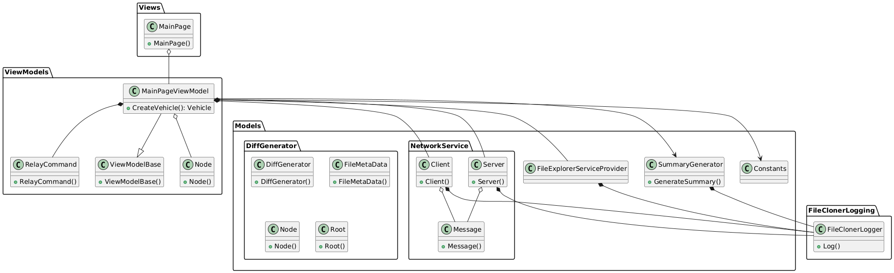

# FileCloner

## Overview
FileCloner is a file synchronization and cloning tool built in C# and WPF, designed to facilitate the efficient sharing and synchronization of files across distributed systems. Developed as a module for a Software Engineering project under [Mr. Ramasawmy Krishnan Chittur](https://github.com/chittur), FileCloner enables peer-to-peer file requests and transfers, making it simple to identify and acquire the latest versions of files across multiple systems. This module is highly collaborative and is structured to manage requests for file clones, summarize updates, and deliver synchronization between users.

**Key Features**
1. **Peer-to-Peer Cloning Requests:** Users can both send cloning requests as a `requester` and respond as a `responder`, creating a decentralized approach for file sharing.
2. **Folder Descriptions:** The `responder` receives a cloning request and replies by sharing a file description, providing details of files available in the requested folder.
3. **Summary Generation:** The `requester` compiles responses from multiple `responders`, generating a summary that identifies files absent from the `requester’s` system or outdated files based on the `responder’s` latest versions.
4. **Selective Cloning:** The `requester` can select specific files to clone. Files missing from the `requester` system appear in green, while outdated files are highlighted in red for easy identification.
5. **Seamless Cloning Process:** Upon selection, clicking the "Start Cloning" button initiates the file transfer from `responder` to `requester`.


## System Design 
FileCloner's peer-to-peer functionality is enabled through an independent `networking` module, which handles server setup and client-server connections. A `dashboard` module is responsible for initiating server operations and managing the client-server communication. The networking module abstracts server functionalities by allowing client-to-client messaging while the server facilitates the message exchange.

**Message Object for Communication**  
FileCloner uses a unified `Message` class for all communications, carrying essential metadata and file content:

```csharp
/// <summary>
/// Represents a message for network communication in FileCloner, encapsulating metadata and content.
/// </summary>
public class Message
{
    public string Subject { get; set; } = "";
    public int RequestID { get; set; } = -1;
    public string From { get; set; } = "";
    public string To { get; set; } = "";
    public string MetaData { get; set; } = "";
    public string Body { get; set; } = "";
}
```

Example of Sending a Message:
```csharp
Message message = new Message
{
    Subject = Constants.request,
    RequestID = requestID,
    From = Constants.IPAddress,
    To = Constants.broadcast
};
client.Send(serializer.Serialize<Message>(message), Constants.moduleName, null);
```

**Server Role**  
The server acts as a routing intermediary. It processes and redirects messages based on the `To` field, enabling both targeted and broadcast messaging:

```csharp
/// <summary>
/// Server class handling client connections, routing, and logging in FileCloner.
/// </summary>
public class Server : INotificationHandler
{
    private static CommunicatorServer server = new();
    private static Dictionary<string, string> clientList = new();
    private readonly Action<string> logAction;
    public void OnDataReceived(string serializedData)
    {
            // Deserialize the message to process its details
            Message message = serializer.Deserialize<Message>(serializedData);

            try
            {
                // Check if the message is a broadcast
                if (message.To == Constants.broadcast)
                {
                    // Send to all connected clients if it's a broadcast
                    server.Send(serializedData, Constants.moduleName, null);
                }
                else
                {
                    // Targeted message; find and send to the specified client
                    string targetClientId = clientList[message.To];
                    server.Send(serializedData, Constants.moduleName, targetClientId);
                }
            }
            catch (Exception e)
            {
                logAction.Invoke("[Server] Error in sending data: " + e.Message);
            }
    }
    public void OnClientJoined(TcpClient client)
    {
            // Retrieve the client's IP address
            string clientIpAddress = ((IPEndPoint)client.Client.RemoteEndPoint).Address.ToString();

            // Generate a unique ID for the client based on the clientid counter
            string clientUniqueId = clientid.ToString();
            logAction.Invoke($"[Server] {clientIpAddress} Joined");

            // Add the client to the client list and increment the counter
            clientList.Add(clientIpAddress, clientUniqueId);
            server.AddClient(clientUniqueId, client);
            clientid++;
     }
}
```

## Class & Module Diagram 


## Development Environment
FileCloner is developed in Visual Studio Community 2022 with .NET 8.0 support. Ensure .NET desktop development tools are installed for optimal performance.

## Contributors 
- **Views & ViewModels**: [Sai Hemanth Reddy](https://github.com/dshreddy) & [Sarath A](https://github.com/sarath-a-12)
- **NetworkService**: [Sai Hemanth Reddy](https://github.com/dshreddy) & [Neeraj Krishna N](https://github.com/nnk03)
- **FileExplorerServiceProvider & Summary Generator**: [Sai Hemanth Reddy](https://github.com/dshreddy)
- **DiffGenerator**: [Evans Samuel Biju](https://github.com/Samuel7Evans7Ph)

## References
[File Explorer UI](https://github.com/felloBonello/FileExplorer/tree/master)
[Class & Module Diagram](https://plantuml.com/)
